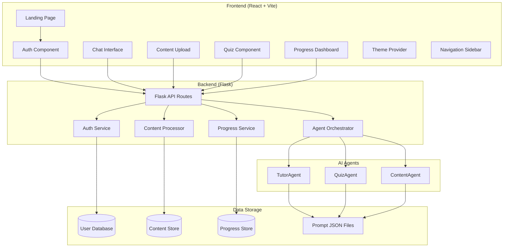

# Design Document: MentorMind AI Tutor

## Overview

MentorMind is a personal AI tutor application built with a React (Vite) frontend and Flask backend. The system employs three specialized AI agents (TutorAgent, QuizAgent, ContentAgent) to provide interactive learning experiences including Q&A tutoring, content summarization, and quiz generation. The application features a split-pane UI with theme switching, progress tracking, and support for anonymous or authenticated users.

## Architecture



### System Flow

1. **User Entry**: Users arrive at the landing page and choose to authenticate or continue anonymously
2. **Navigation**: Authenticated users access the split-pane UI with sidebar navigation
3. **Chat Interaction**: Questions are sent to Flask API, routed to TutorAgent, responses displayed in chat
4. **Content Upload**: Files uploaded to Flask, processed by ContentAgent, summaries stored and made available
5. **Quiz Generation**: QuizAgent generates questions from topics or uploaded content
6. **Progress Tracking**: Quiz results and interactions stored, visualized in Progress Dashboard

## Components and Interfaces

### Frontend Components

#### ThemeProvider
```jsx
// Manages light/dark theme state and Tailwind class toggling
interface ThemeContext {
  theme: 'light' | 'dark';
  toggleTheme: () => void;
}
```

#### AuthContext
```jsx
// Manages user authentication state
interface AuthContext {
  user: User | null;
  isAnonymous: boolean;
  login: (credentials: Credentials) => Promise<void>;
  register: (userData: UserData) => Promise<void>;
  continueAnonymously: () => void;
  logout: () => void;
}
```

#### ChatInterface
```jsx
// Main chat component for TutorAgent interaction
interface ChatMessage {
  id: string;
  role: 'user' | 'assistant';
  content: string;
  timestamp: Date;
}

interface ChatInterfaceProps {
  messages: ChatMessage[];
  onSendMessage: (content: string) => Promise<void>;
  isLoading: boolean;
}
```

#### ContentUploader
```jsx
// Handles file upload for videos and PDFs
interface UploadedContent {
  id: string;
  filename: string;
  type: 'video' | 'pdf';
  summary: string[];
  uploadedAt: Date;
}

interface ContentUploaderProps {
  onUploadComplete: (content: UploadedContent) => void;
  onError: (error: string) => void;
}
```

#### QuizComponent
```jsx
// Displays and manages quiz interactions
interface QuizQuestion {
  id: string;
  question: string;
  options: string[];
  correctIndex: number;
  explanation: string;
}

interface QuizState {
  questions: QuizQuestion[];
  currentIndex: number;
  answers: number[];
  isComplete: boolean;
  score: number;
}
```

#### ProgressDashboard
```jsx
// Visualizes learning progress
interface ProgressData {
  totalQuizzes: number;
  averageScore: number;
  topicsMastered: string[];
  topicsNeedingWork: string[];
  progressOverTime: { date: string; score: number }[];
}
```

### Backend API Endpoints

#### Authentication Routes
```python
POST /api/auth/register
  Request: { email: str, password: str, name: str }
  Response: { user: User, token: str }

POST /api/auth/login
  Request: { email: str, password: str }
  Response: { user: User, token: str }

POST /api/auth/anonymous
  Response: { sessionId: str, isAnonymous: true }
```

#### Chat Routes
```python
POST /api/chat/message
  Request: { message: str, contentContext?: str[] }
  Response: { response: str, messageId: str }
```

#### Content Routes
```python
POST /api/content/upload
  Request: multipart/form-data { file: File }
  Response: { contentId: str, summary: str[], keyPoints: str[] }

GET /api/content/list
  Response: { contents: UploadedContent[] }
```

#### Quiz Routes
```python
POST /api/quiz/generate
  Request: { topic?: str, contentId?: str, questionCount: int }
  Response: { quizId: str, questions: QuizQuestion[] }

POST /api/quiz/submit
  Request: { quizId: str, answers: int[] }
  Response: { score: int, results: QuizResult[] }
```

#### Progress Routes
```python
GET /api/progress
  Response: { progressData: ProgressData }
```

### Agent Orchestrator

```python
class AgentOrchestrator:
    def __init__(self, prompts_dir: str):
        self.tutor_agent = self._load_agent('TutorAgent')
        self.quiz_agent = self._load_agent('QuizAgent')
        self.content_agent = self._load_agent('ContentAgent')
    
    def _load_agent(self, agent_name: str) -> AgentConfig:
        # Load prompt configuration from JSON file
        pass
    
    def process_chat(self, message: str, context: list) -> str:
        # Route to TutorAgent with context
        pass
    
    def generate_quiz(self, topic: str, content: str) -> list:
        # Route to QuizAgent
        pass
    
    def process_content(self, file_path: str) -> dict:
        # Route to ContentAgent
        pass
```

## Data Models

### User Model
```python
class User:
    id: str
    email: str | None  # None for anonymous users
    name: str
    password_hash: str | None
    is_anonymous: bool
    created_at: datetime
    last_login: datetime
```

### Content Model
```python
class Content:
    id: str
    user_id: str
    filename: str
    file_type: str  # 'video' | 'pdf'
    file_path: str
    summary: list[str]
    key_points: list[str]
    processed_at: datetime
```

### Quiz Model
```python
class Quiz:
    id: str
    user_id: str
    topic: str
    content_id: str | None
    questions: list[QuizQuestion]
    created_at: datetime

class QuizQuestion:
    id: str
    question: str
    options: list[str]
    correct_index: int
    explanation: str

class QuizResult:
    id: str
    quiz_id: str
    user_id: str
    answers: list[int]
    score: int
    completed_at: datetime
```

### Progress Model
```python
class UserProgress:
    user_id: str
    total_quizzes: int
    total_questions: int
    correct_answers: int
    topics_attempted: dict[str, TopicProgress]
    history: list[ProgressEntry]

class TopicProgress:
    topic: str
    attempts: int
    correct: int
    mastery_level: float  # 0.0 to 1.0

class ProgressEntry:
    date: datetime
    quiz_id: str
    score: float
    topic: str
```

### Agent Prompt Model
```python
class AgentPrompt:
    name: str
    role: str
    description: str
    system_prompt: str
    example_format: dict
    context_guidance: list[str]
```


## Correctness Properties

*A property is a characteristic or behavior that should hold true across all valid executions of a system—essentially, a formal statement about what the system should do. Properties serve as the bridge between human-readable specifications and machine-verifiable correctness guarantees.*

### Property 1: User Registration and Login Round-Trip

*For any* valid user registration data (email, password, name), registering a user and then logging in with those credentials should return the same user profile with matching email and name.

**Validates: Requirements 1.3, 1.4**

### Property 2: Invalid Credentials Rejection

*For any* credential combination where the email does not exist in the system OR the password does not match the stored hash, the authentication attempt should fail and return an error response.

**Validates: Requirements 1.5**

### Property 3: Theme Detection Consistency

*For any* prefers-color-scheme value ('light' or 'dark'), when the application loads, the applied theme class should match the detected preference.

**Validates: Requirements 3.4**

### Property 4: Theme Toggle Round-Trip

*For any* initial theme state, toggling the theme twice should return the application to the original theme state.

**Validates: Requirements 3.5**

### Property 5: TutorAgent Response Generation

*For any* non-empty question string submitted to the TutorAgent, the agent should return a non-empty response string within the timeout period.

**Validates: Requirements 4.2**

### Property 6: Content-Aware TutorAgent Responses

*For any* uploaded and processed content, when a question related to that content is asked with the content context provided, the TutorAgent response should reference or incorporate information from the content summary.

**Validates: Requirements 4.5**

### Property 7: File Upload Type Validation

*For any* file upload attempt, if the file type is 'video' or 'pdf', the upload should be accepted; for any other file type, the upload should be rejected with an appropriate error.

**Validates: Requirements 5.1, 5.4**

### Property 8: Content Extraction Produces Key Points

*For any* successfully uploaded video or PDF file, the ContentAgent should extract and return a non-empty list of key points.

**Validates: Requirements 5.2**

### Property 9: Processed Content Availability

*For any* content that has been successfully processed, querying the content list should include that content, and the content should be retrievable by its ID for use by TutorAgent and QuizAgent.

**Validates: Requirements 5.5**

### Property 10: Quiz Generation Structure Validity

*For any* valid topic string or content ID, the QuizAgent should generate a quiz where each question has: a non-empty question string, at least 2 options, a valid correctIndex within the options range, and a non-empty explanation.

**Validates: Requirements 6.1**

### Property 11: Quiz Answer Recording

*For any* quiz question and selected answer index, the system should record the answer and the recorded answer should match the submitted value when retrieved.

**Validates: Requirements 6.3**

### Property 12: Quiz Score Calculation Correctness

*For any* completed quiz with N questions and a set of answers, the calculated score should equal the count of answers where the selected index matches the correct index, divided by N.

**Validates: Requirements 6.4, 6.5**

### Property 13: Progress Success Rate Calculation

*For any* set of quiz results for a user, the success rate displayed should equal (total correct answers / total questions attempted) * 100, rounded appropriately.

**Validates: Requirements 7.2**

### Property 14: Topic Mastery Categorization

*For any* topic with quiz attempts, if the success rate for that topic is >= 80%, it should appear in "topics mastered"; if < 50%, it should appear in "topics needing improvement".

**Validates: Requirements 7.3**

### Property 15: Progress Update After Quiz

*For any* newly completed quiz, the progress data should be updated to include the new quiz results, and the total quizzes count should increment by 1.

**Validates: Requirements 7.5**

### Property 16: Agent Prompt Loading and Validation

*For any* agent (TutorAgent, QuizAgent, ContentAgent), loading the prompt configuration should return a valid AgentPrompt object containing: name, role, description, system_prompt, example_format, and context_guidance fields.

**Validates: Requirements 8.4, 8.5**

## Error Handling

### Authentication Errors
- **Invalid credentials**: Return 401 with message "Invalid email or password"
- **Email already exists**: Return 409 with message "An account with this email already exists"
- **Missing required fields**: Return 400 with specific field validation errors
- **Session expired**: Return 401 with message "Session expired, please login again"

### Content Upload Errors
- **Invalid file type**: Return 400 with message "Only video and PDF files are supported"
- **File too large**: Return 413 with message "File size exceeds maximum limit of {limit}MB"
- **Processing failure**: Return 500 with message "Failed to process content: {reason}"
- **Content not found**: Return 404 with message "Content not found"

### Agent Errors
- **Agent timeout**: Return 504 with message "AI agent took too long to respond"
- **Agent unavailable**: Return 503 with message "AI service temporarily unavailable"
- **Invalid prompt configuration**: Log error and fall back to default prompt
- **Context too large**: Truncate context and log warning

### Quiz Errors
- **Quiz not found**: Return 404 with message "Quiz not found"
- **Invalid answer index**: Return 400 with message "Answer index out of range"
- **Quiz already completed**: Return 409 with message "Quiz has already been submitted"

### General Errors
- **Rate limiting**: Return 429 with message "Too many requests, please try again later"
- **Internal server error**: Return 500 with generic message, log detailed error
- **Network errors**: Frontend displays retry option with user-friendly message

## Testing Strategy

### Testing Framework Selection

**Frontend (React/JavaScript)**:
- Unit/Integration: Vitest (fast, Vite-native)
- Property-based testing: fast-check
- Component testing: React Testing Library

**Backend (Python/Flask)**:
- Unit/Integration: pytest
- Property-based testing: Hypothesis
- API testing: pytest with Flask test client

### Unit Testing Approach

Unit tests will cover:
- Individual component rendering and behavior
- Service function logic (authentication, progress calculation)
- Data model validation
- Utility functions (score calculation, theme detection)
- API route handlers with mocked dependencies

Focus areas:
- Edge cases (empty inputs, boundary values)
- Error conditions and exception handling
- State transitions in UI components

### Property-Based Testing Approach

Each correctness property will be implemented as a property-based test:
- Minimum 100 iterations per property test
- Custom generators for domain objects (User, Quiz, Content)
- Shrinking enabled to find minimal failing examples

**Test Annotation Format**:
```python
# Feature: mentormind-ai-tutor, Property 1: User Registration and Login Round-Trip
# Validates: Requirements 1.3, 1.4
```

**Generator Strategy**:
- `UserDataGenerator`: Valid email formats, password strings, names
- `QuizGenerator`: Valid questions with options and correct indices
- `ContentGenerator`: Mock file data with valid types
- `TopicGenerator`: Non-empty topic strings

### Integration Testing

- API endpoint integration tests with real database
- Agent orchestration tests with mocked AI responses
- End-to-end user flows (registration → chat → quiz → progress)

### Test Organization

```
/frontend
  /src
    /__tests__
      /unit          # Unit tests
      /properties    # Property-based tests
      /integration   # Integration tests
    /components
      Component.test.jsx  # Co-located component tests

/backend
  /tests
    /unit            # Unit tests
    /properties      # Property-based tests (Hypothesis)
    /integration     # API integration tests
    conftest.py      # Shared fixtures
```
